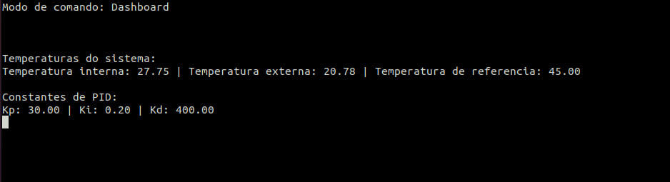
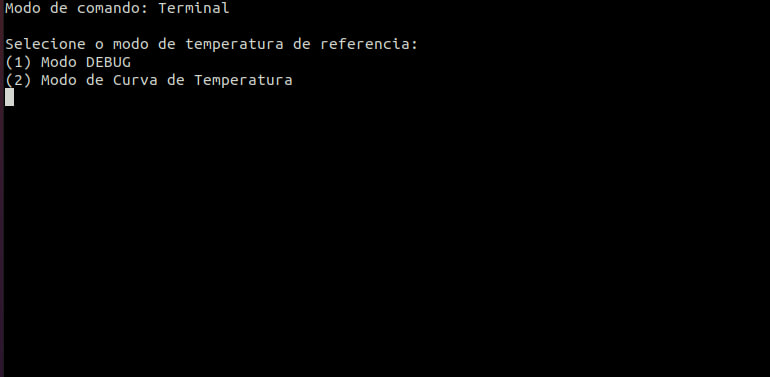
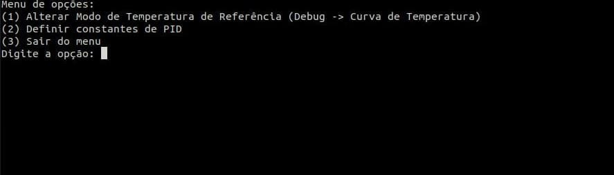

# Projeto 2 - Fundamentos de Sistemas Embarcados

## Requisitos

* make
* gcc

## Como executar

Primeiro digite esse comando para compilar o código

```
  make
```

Após o build rode o programa

```
  make run
```

## Objetivo

Este trabalho tem por objetivo a implementação de um sistema (que simula) o controle de um forno para soldagem de placas de circuito impresso (PCBs). Abaixo vemos alguns exemplos de fornos comerciais para este propósito.

## Como utilizar

Assim que o programa inicia ele estará no modo dashboard, ou seja todas as ações serão controladas pelo dashboard.



Para mudar para o modo terminal, basta clicar no botão no dashboard

")

Ao clicar no botão, e ao acessar o modo terminal pela primeira vez, o programa irá perguntar em que modo de temperatura de referência você deseja utilizar.



Tendo escolhido o modo DEBUG, um menu do modo terminal irá aparecer para mostrar outras opções



Nesse menu você poderá alterar o modo de temperatura de referência, selecionar as constantes de PID (Kp, Ki, Kd), ou sair do menu.

Ao selecionar a opção 2, o programa irá perguntar o valor das constantes que deseja utilizar para o cálculo do PID.


Para finalizar o programa em qualquer ponto do funcionamento, basta apertar as teclas CTRL + C.


## Graficos

As medições dos gráficos foram realizadas num intervalo de aproximadamente 5 minutos cada um.

### 1. Gráfico de temperatura fixa

**Potência do Resistor e Ventoinha no tempo**

.png "Temperatura Fixa (% Resitor e % Ventoinha)")

### 2. Gráfico de curva de temperatura

**Potência do Resistor e Ventoinha no tempo**

.png "Curva de temperatura (% Resistor e % Ventoinha)")

## Apresentação

A apresentação deste trabalho pode ser acessada através deste link: [Apresentação - Trabalho 2](https://www.youtube.com/watch?v=80PLBp2DEBA)